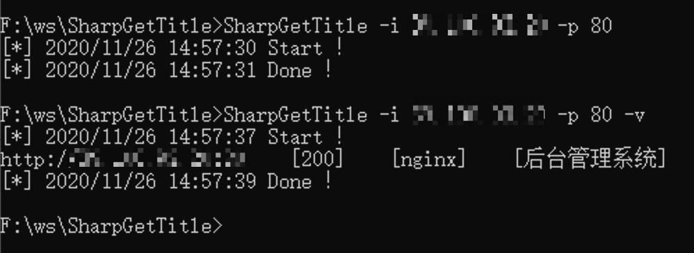

# SharpGetTitle
SharpGetTitle - 基于 C# 的多线程 Web Title 扫描器

# 简介
由于在平时内网渗透中需要获取 C/B 段的 Web 信息，从而更加准确的进行定点渗透，所以基于 SharpWebScan 开发了此工具。此工具使用了 ThreadPool 作为多线程进行并发，并将编译环境降至 .NET 3.5，以便在 CobaltStrike 或者一些较旧的机器上运行。

# 使用
CommandLine:
```
SharpGetTitle.exe -i 127.0.0.1
SharpGetTitle.exe -i 127.0.0.1 -v
SharpGetTitle.exe -i 127.0.0.1 -p 80-443
SharpGetTitle.exe -i 127.0.0.1/24 -p 80-443
SharpGetTitle.exe -i 127.0.0.1-127.0.0.255 -p 80-443 -o demo.txt
```
Run in Cobaltstrike:
```
execute-assembly SharpGetTitle "-i 127.0.0.1 -p 80"
```
-v 参数的含义请看下图



# 感谢
https://github.com/RcoIl/CSharp-Tools/tree/master/SharpWebScan
